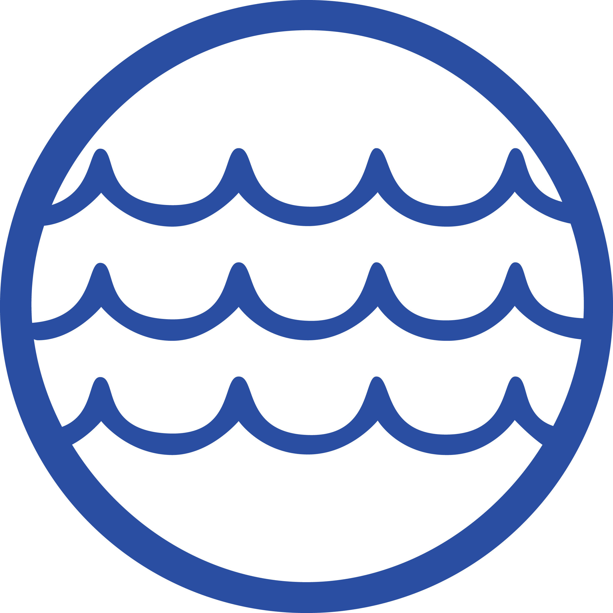

<h1> Lake Metabolism Lab</h1>

A static, browser-based lab for UW–Madison Zoology 316 (Limnology), built around real
high-frequency buoy data from Lake Mendota. Students explore timeseries data, build an
intuition for the oxygen budget, and estimate lake metabolism — no installation or server
required, just open the pages in a browser.

This lab was developed for UW–Madison Zoology 316 (Limnology). It is licensed under a
[Creative Commons Attribution 4.0 International License (CC BY 4.0)](https://creativecommons.org/licenses/by/4.0/)
— you are free to share and adapt this material for any purpose, including commercially, as
long as you give appropriate credit.
